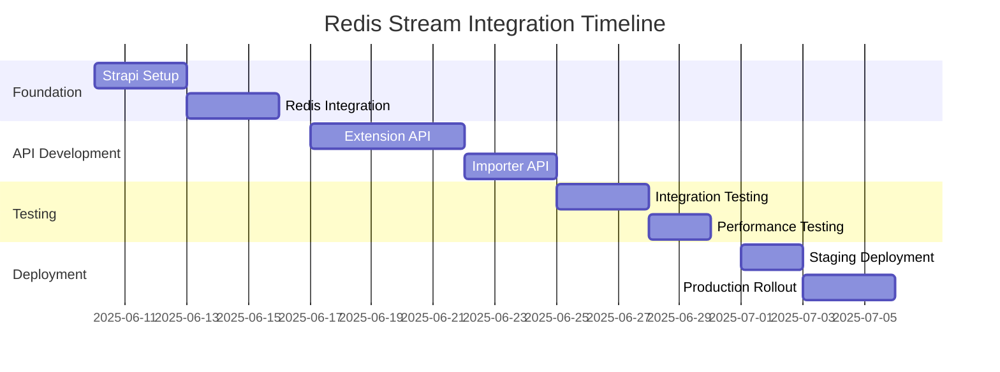

# Redis Stream Integration Plan for Rate Platform

> **Note:** Strapi Importer API is forward-only. No raw submissions are stored in CMS/Postgres. All data is published to Redis Streams for Validator processing.


## 🎯 Objectives & Overview

This document details the end-to-end Redis Streams integration for the Rate Platform, connecting Extension, Importer, and Validator modules through a unified Strapi v5.14 backend. The goal is to deliver a production-grade, zero-downtime, and developer-friendly message bus for both real-time and bulk workflows, with a strong focus on security, reliability, and operational excellence.

### Key Objectives
- **Zero-downtime** deployment for Strapi and Validator worker (PM2 cluster, rolling-restart)
- **Reliable message bus** for both real-time (Extension) and bulk (Importer) validation
- **Production-grade operations:**
  - Security: Redis ACL, JWT/API-token scopes, rate limiting
  - Observability: Prometheus, Grafana, pgaudit, health checks
  - Error tracking: DLQ (dead-letter queue), retry, stream trimming
  - Data retention: PostgreSQL hybrid schema, partitioning, S3 backup
- **Developer ergonomics:**
  - Fast onboarding, clear documentation, easy local dev (yarn, Docker)
  - Automated CI/CD, backup, and monitoring

### Solution Summary
- **Backend:** Strapi v5.14 (custom endpoints, hybrid Content-Type for UI)
- **Message Bus:** Redis Streams (consumer groups, DLQ, ACL)
- **Persistence:** PostgreSQL (JSONB, partitioned tables, uuidv7)
- **Process Manager:** PM2 (cluster, rolling-reload)
- **Monitoring:** Prometheus, Grafana, pgaudit
- **CI/CD:** GitHub Actions + pm2 reload

### High-Level Architecture

```mermaid
graph LR
  subgraph Clients
    A[Rate-Extension]
    B[Rate-Importer]
  end

  subgraph Strapi API
    C[Strapi (cluster PM2)]
    C1[/api/validation/.../]
    C2[/api/importer/.../]
  end

  subgraph Redis
    D[validation_requests Stream]
    E[extension_responses Stream]
    F[importer_responses Stream]
    G[validation_dlq Stream]
  end

  subgraph Validator
    H[Validator Worker (cluster PM2)]
  end

  A -->|HTTPS JWT/API-Token| C1
  B -->|HTTPS API-Token| C2
  C1 & C2 -->|XADD→D| D
  H -->|XREADGROUP→D| D
  H -->|XACK / XTRIM→D| D
  H -->|XADD→E| E
  H -->|XADD→F| F
  C1 <--|XREADGROUP←E| E
  C2 <--|XREADGROUP←F| F
  H -->|XADD→G| G
  C & H -->|PostgreSQL| I[(validation_requests, validation_responses, raw_item_errors)]
```

---

## 📋 Integration Components

### 1. **Strapi Backend (API Gateway & Orchestrator)**

- **Role:** Central API gateway and orchestrator for all modules
- **Responsibilities:**
  - JWT & API token authentication, role-based scopes
  - Request validation, enrichment, and normalization
  - Publishes validation/import requests to Redis Streams
  - Subscribes to response streams for status/result
  - Hybrid Content-Type for admin UI visibility (optional)
  - WebSocket server for real-time push to Extension
  - Webhook callbacks for Importer/bulk jobs
  - Rate limiting, audit logging, error masking

### 2. **Redis Streams (Message Bus)**

- **Role:** Asynchronous, decoupled message bus
- **Streams:**
  - `validation_requests`: All validation/import requests (input)
  - `extension_responses`: Results for Extension (output)
  - `importer_responses`: Results for Importer (output)
  - `validation_dlq`: Dead-letter for failed/expired jobs
  - `monitoring_events`: Optional, for metrics/alerts

### 3. **Module Integration Points**

#### Rate-Extension Integration

```text
Extension → Strapi API (/api/validation/validate, /status/:id, /batch) → Redis Stream → Validator Worker → extension_responses → Strapi (WebSocket push)
```
- **Endpoints:**
  - `POST /api/validation/validate` — Validate one or more items
  - `GET  /api/validation/status/:requestId` — Check status/result
  - `POST /api/validation/batch` — Batch validation
  - `WS   /api/validation/ws` — Real-time updates (WebSocket)

#### Rate-Importer Integration

```text
Importer → Strapi API (/api/importer/import, /status/:id, /bulk) → Redis Stream → Validator Worker → importer_responses → Strapi (webhook callback)
```
- **Endpoints:**
  - `POST /api/importer/import` — Import items for validation
  - `GET  /api/importer/status/:requestId` — Check import status
  - `POST /api/importer/bulk` — Bulk dataset import
  - `Webhook callback` — POST to Importer when done

#### Validator Worker
- **Role:**
  - Consumes from `validation_requests` (with consumer group)
  - Processes validation logic, persists to PostgreSQL
  - Publishes results to `extension_responses` or `importer_responses`
  - Publishes errors to `validation_dlq` if needed
  - Emits monitoring events if enabled

#### Monitoring & Observability
- **Streams:**
  - `monitoring_events` (optional): For Prometheus/Grafana
- **Endpoints:**
  - `/api/health` — Health check for orchestrator/worker
  - `/metrics` — Prometheus scrape endpoint

---

## 🚀 Implementation Plan & Roadmap

### Phase 1: Core Integration (Week 1-2)
- [x] **Strapi v5.14 Setup**: Ensure project is on Strapi v5.14, keep yarn as package manager
- [x] **Redis Client**: Install `redis` npm package (v5.5.6+)
- [x] **.env Configuration**: Add `REDIS_URL` and required secrets
- [x] **Redis Service**: Implement `src/services/redisStream.js` with:
  - Auto-reconnect
  - publishValidationRequest()
  - subscribeToResponses()
  - getRequestStatus()
  - DLQ support
- [x] **API Endpoints**:
  - `/api/validation/validate`, `/api/validation/status/:requestId`, `/api/validation/batch`
  - `/api/importer/import`, `/api/importer/status/:requestId`, `/api/importer/bulk`
- [x] **Bootstrap Logic**: Init Redis, subscribe to response streams in `src/index.js`
- [x] **JWT & API Token Auth**: Secure endpoints, add role-based scopes
- [x] **Basic Docs**: Write API usage docs for Extension/Importer

### Phase 2: Production Hardening (Week 3-4)
- [ ] **WebSocket Support**:
  - Implement `/api/validation/ws` for real-time Extension updates
  - Integrate with Redis pub/sub for push
- [ ] **Webhook Callbacks**:
  - Add webhook support for Importer bulk jobs
- [ ] **Rate Limiting**:
  - Add middleware for per-user/token rate limits
- [ ] **Hybrid Content-Type**:
  - Create Content-Type for admin UI (optional, for monitoring/history)
- [ ] **DLQ Monitoring**:
  - Expose `/api/monitoring/dlq` endpoint for failed jobs
- [ ] **Health Check**:
  - Implement `/api/health` endpoint for orchestrator/worker

### Phase 3: Monitoring & Scaling (Week 5+)
- [ ] **Prometheus Metrics**:
  - `/metrics` endpoint, stream lag, queue size, error rate
- [ ] **Grafana Dashboard**:
  - Visualize key metrics
- [ ] **pgaudit & Audit Logging**:
  - Enable PostgreSQL auditing, log critical API actions
- [ ] **PM2 Cluster**:
  - Run Strapi and Validator Worker in cluster mode
  - Use rolling-restart for zero-downtime deploys
- [ ] **Backup & Disaster Recovery**:
  - Automate PostgreSQL WAL/S3 and Redis RDB/S3
  - Document restore process

### Best Practices Checklist
- [ ] Use `uuidv7` for all request/result IDs
- [ ] Partition validation tables by month for performance
- [ ] Stream trim logic: keep only recent N jobs, archive old
- [ ] Separate dev/staging/prod config for Redis/DB
- [ ] Document all endpoints and flows in `API-Documentation.md`
- [ ] Regularly test disaster recovery and rollback
- [ ] Use Pascal-Case-with-dashes for all new markdown docs

---

- [ ] End-to-end integration testing
- [ ] Performance optimization
- [ ] Error handling improvements
- [ ] Documentation completion

---

## 🗄️ Database Schema & Persistence

### Hybrid Persistence Model
- **Strapi Content-Type** (optional): Used for admin UI visibility, audit trail, and manual review. Stores summary metadata of requests/results.
- **Validator DB (`raw_items` table)**: Stores all validation data, results, and errors for high-throughput, partitioned storage. Optimized for analytics and retention.

### Redis Streams Data Model
| Stream Name            | Purpose                             | Key Fields                        |
|-----------------------|-------------------------------------|-----------------------------------|
| validation_requests   | All validation/import requests (in)  | uuidv7, payload, source, ts       |
| extension_responses   | Results for Extension module         | uuidv7, result, error, ts         |
| importer_responses    | Results for Importer module          | uuidv7, batch_id, result, ts      |
| validation_dlq        | Failed/expired jobs                  | uuidv7, error, fail_count, ts     |

- **uuidv7**: Used as primary key for all requests/results for performance and time-sortability.
- **Partitioning**: `raw_items` table partitioned by month (e.g., `raw_items_2025_06`) for efficient querying and retention.
- **Stream Trim Policy**: Keep only N most recent jobs in Redis Streams (e.g., 30 days or 100k items), archive older data to PostgreSQL/S3.

### Example Table: `raw_items` (Validator DB)
| Field         | Type      | Description                  |
|-------------- |---------- |-----------------------------|
| id            | uuidv7    | Primary key                  |
| payload       | jsonb     | Original validation data     |
| source        | text      | 'extension' or 'importer'    |
| status        | text      | pending/success/error/dlq    |
| result        | jsonb     | Validation results           |
| error         | jsonb     | Error details (if any)       |
| created_at    | timestamptz | Request received time      |
| updated_at    | timestamptz | Last update                |

### Data Retention & Backup Checklist
- [ ] Partition tables by month for large-scale retention
- [ ] Regularly trim Redis Streams (XTRIM)
- [ ] Automate PostgreSQL WAL/S3 and Redis RDB/S3 backups
- [ ] Document and test restore procedures quarterly
- [ ] Mask sensitive fields in logs and exports

### Best Practices
- Use `uuidv7` everywhere for traceability and sort-order
- Avoid storing PII in Redis Streams; mask or encrypt if needed
- Use hybrid model for best of both: fast UI + robust analytics
- Monitor partition growth and automate old partition archiving
- Validate backup integrity regularly

---

## 🔒 Monitoring, Security, Zero-Downtime & Backup

### Monitoring & Observability
- **Prometheus**: Scrape `/metrics` endpoint (Strapi, Validator Worker, Redis Exporter)
- **Grafana**: Dashboards for stream lag, queue size, error rates, API latency
- **Redis Exporter**: Expose Redis metrics for Prometheus
- **pgaudit**: Enable PostgreSQL auditing for all critical actions
- **Health Endpoints**: `/api/health` for orchestrator/worker, alerting integration

### Security
- **Redis ACL**: Fine-grained access control for streams and commands
- **JWT/API Tokens**: Role-based scopes for all Strapi endpoints
- **Rate Limiting**: Middleware for per-user/token request limits
- **Log Masking**: Mask sensitive fields in logs and exports
- **Network**: Use TLS for all external endpoints (Nginx reverse proxy)

### Zero-Downtime Deployment
- **PM2 Cluster**: Run Strapi and Validator Worker with clustering
- **Rolling-Restart**: Use `pm2 reload` for zero-downtime deploys
- **Nginx Proxy**: Load balancing and HTTPS termination
- **Health Checks**: Automated health endpoints for orchestrator, worker, Redis, PostgreSQL

### Backup & Disaster Recovery
- **PostgreSQL**: WAL archiving to S3, regular base backups
- **Redis**: RDB snapshot backups to S3, monitor persistence
- **Restore Checklist**:
  - Document restore steps for both DB and Redis
  - Test restore quarterly and after major upgrade
  - Monitor backup job success/failure

### Best Practices Checklist
- [ ] All monitoring endpoints documented and scraped
- [ ] Redis ACLs enforced in production
- [ ] JWT/API token secrets rotated regularly
- [ ] Rate limiting tested under load
- [ ] Log and export masking verified
- [ ] PM2/Nginx health checks automated
- [ ] Backup/restore process tested and documented

## 📊 Data Flow Specifications

### Request Message Format

## 📓 Changelog & Lessons Learned

- See [Changelog-And-Lessons-Learned.md](./Changelog-And-Lessons-Learned.md) for full changelog, breaking changes, and key lessons from the Redis Stream integration.

```json
{
  "request_id": "req_123456",
  "source": "extension|importer|api",
  "user_id": "user_123",
  "action": "validate|check|import",
  "data": {
    "items": [
      {
        "name": "John Doe",
        "phone": "0123456789",
        "bank_account": "1234567890",
        "metadata": {}
      }
    ]
  },
  "priority": "high|normal|low",
  "callback_config": {
    "stream": "extension_responses",
    "webhook_url": null
  },
  "timestamp": "2025-06-08T12:00:00Z"
}
```

### Response Message Format

```json
{
  "request_id": "req_123456",
  "status": "success|partial|error",
  "results": [
    {
      "item_id": "item_001",
      "verdict": "DONE|ERROR",
      "error_code": null,
      "confidence": 0.95,
      "details": {}
    }
  ],
  "processing_time_ms": 150,
  "timestamp": "2025-06-08T12:00:01Z"
}
```

## 🔧 Technical Implementation

### Strapi Service Layer

```javascript
// services/redis-stream.js
class RedisStreamService {
  async publishValidationRequest(data, source) {
    const message = {
      request_id: generateRequestId(),
      source,
      data,
      timestamp: new Date().toISOString()
    };
    
    await redis.xadd(
      'validation_requests',
      '*',
      'data', JSON.stringify(message)
    );
    
    return message.request_id;
  }
  
  async subscribeToResponses(stream, callback) {
    // Consumer group subscription logic
  }
}
```

### API Controller Example

```javascript
// controllers/validation.js
async check(ctx) {
  const { body } = ctx.request;
  const requestId = await strapi
    .service('api::validation.redis-stream')
    .publishValidationRequest(body, 'extension');
    
  ctx.body = {
    request_id: requestId,
    status: 'processing'
  };
}
```

## 🛡️ Security Considerations

1. **Authentication**:
   - JWT tokens for Extension/Importer
   - API key validation
   - Rate limiting per source

2. **Data Privacy**:
   - Encrypt sensitive data in transit
   - Mask personal information in logs
   - Implement data retention policies

3. **Access Control**:
   - Role-based permissions
   - Source-specific endpoints
   - Audit logging

## 📈 Monitoring & Metrics

### Key Metrics to Track

- Request volume by source
- Processing time percentiles
- Error rates by type
- Queue depth and lag
- API response times

### Monitoring Stack

```text
Strapi Logs → Winston → CloudWatch/ELK
Redis Metrics → Redis Exporter → Prometheus
Application Metrics → Custom Metrics → Grafana
```

## 🔄 Migration Strategy

### From Current State to Target Architecture

1. **Current**: Direct module connections
2. **Phase 1**: Add Strapi API layer
3. **Phase 2**: Introduce Redis Streams
4. **Phase 3**: Migrate all modules
5. **Phase 4**: Deprecate direct connections

## 📚 Documentation Requirements

1. **API Documentation**:
   - OpenAPI/Swagger specs
   - Integration examples
   - Authentication guide

2. **Developer Guides**:
   - Module integration guide
   - Local development setup
   - Troubleshooting guide

3. **Operations Manual**:
   - Deployment procedures
   - Monitoring setup
   - Incident response

## ✅ Success Criteria

- [ ] All modules communicating through Strapi
- [ ] Zero message loss in Redis Streams
- [ ] <200ms API response time (p95)
- [ ] 99.9% uptime for API gateway
- [ ] Complete audit trail for all operations

## 🚨 Risk Mitigation

| Risk | Impact | Mitigation |
|------|--------|------------|
| Redis failure | High | Redis Sentinel/Cluster setup |
| API overload | Medium | Rate limiting, auto-scaling |
| Data inconsistency | High | Transaction support, validation |
| Security breach | Critical | Regular audits, encryption |

## 📅 Timeline



---

*Last Updated: 2025-06-08*
*Version: 1.0.0*
